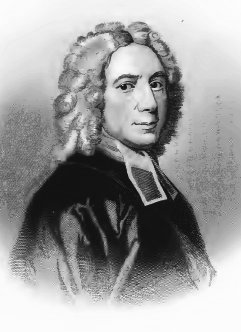

# The Abney Language

_A Haskell-like language with a typed IR for informed re-targeting_

## Purpose and Objectives

Abney began as an attempt to create yet another typed Scheme. Upon reflection, I realized that, not
being a Schemer myself, this was a very dumb idea. So I retargeted the yet unborn project, realizing
I needed a whole different animal. Here's what I'm trying to do:

- Abney would be a scripting language for my game engine (targeting an embeddable, small virtual
  machine), but its front-end should generate a well documented, statically-typed, portable
  intermediate representation that a number of backends can generate code from. My current strategy
  is to have two: one that writes bytecode for the aforementioned VM, another that generates LLVM IR.

- The language borrows mostly from [**Haskell**](http://Haskell.org) (which brings together many good
  ideas from typed functional programming) and a number of other languages
  (e.g., [_Rust_](http://rust-lang.org), [_PureScript_](http://purescript.org),
  [_OCaml_](http://ocaml.org), and yes, the [_Lisp_](https://lisp-lang.org/) family) for specific
  features.

- I want to have a good look at
  OCaml's _modules_ and Haskell's _typeclasses_ and see if it's possible to unify them. I want aliased
  modules _and_ imports á la Rust.

- **Strict evaluation** and Rust-style deterministic memory management, i.e.,
  _without_ garbage collection. These make reasoning about performance nigh-impossible in Haskell.

- To enchance safety and soundness, it should be a dependent-types language as well. Here I expect to
  borrow heavily from [_Idris_](http://idris-lang.org) -- in means as much as in philosphy: _Abney_ is
  primarily meant for programming work. I _might_ work on proving mechanisms later, but only to
  introduce stronger type assertion mechanisms.

- Despite all this, I'm aiming for a small core language and small runtime. I'm not fond of bloat.

- Macros (typed or otherwise) to allow rich metaprogramming, including _attribute_ processing and
  embedded languages.

## Usability disclaimer

Abney is in _pre-alpha_ state at this moment. No guarantees are made respective to timeframes for
readiness, minimum or otherwise. Writing a compiler is plenty of work and I'm just one guy,
dang it.

## Building

Abney requires GHC and a Linux-style environment. In Windows, this can be accomplished through
[MSYS2](https://www.msys2.org/) (however, the resulting target files are not dependent upon it.)

## About the name

Logician, theologian and non-conformist **Isaac Watts** (1674-1748) lived in the Abney manor for more
than 36 years, as a grace from benefactor Lady Mary Abney. He particularly enjoyed Abney Park,
which also led to a place he'd seek when in need of inspiration. Abney House was also where he died,
and of a statue that commemorates him was erected there.

Atypically for his time, Watts was careful to distinguish _prepositions_ from _judgments_. His
primary work on logic, _Logick: or, the Right use of Reason in the Enquiry After Truth, with a Variety
of Rules to Guard Against Error in the Affairs of Religion and Human Life, as Well as in the
Sciences_, was the standard text on logic in Cambridge, Oxford, Yale and Harvard; in Oxford,
particularly, it held this prestigious position for over a century.

Notoriously, Watts influenced **Michael Faraday** through his work _Improvement of the Mind_, and is
referred to by **Melville** in chapter 22 of _Moby-Dick_: to counteract the propension of his sailors
to sing prophane _shanties_, the captain of the _Pequod_ "placed a small choice copy of Watts in each
seaman’s berth." He is also cited by **Dickens** in _David Copperfield_.

As a theologian, Watts is credited with the introduction of hymns to the British church. He is the
author of the universally known _Joy to the World_. I was tempted to name the language "joy" after
this fact, but the name was [taken](https://www.latrobe.edu.au/humanities/research/research-projects/past-projects/joy-programming-language).

## License

Abney is distributed under the [MIT license](https://mit-license.org/). For specifics see the
[LICENSE.txt](./LICENSE.txt) file.

## Feedback

Send to [10951848+CubOfJudahsLion at users.noreply.github.com](mailto:10951848+CubOfJudahsLion@users.noreply.github.com).
